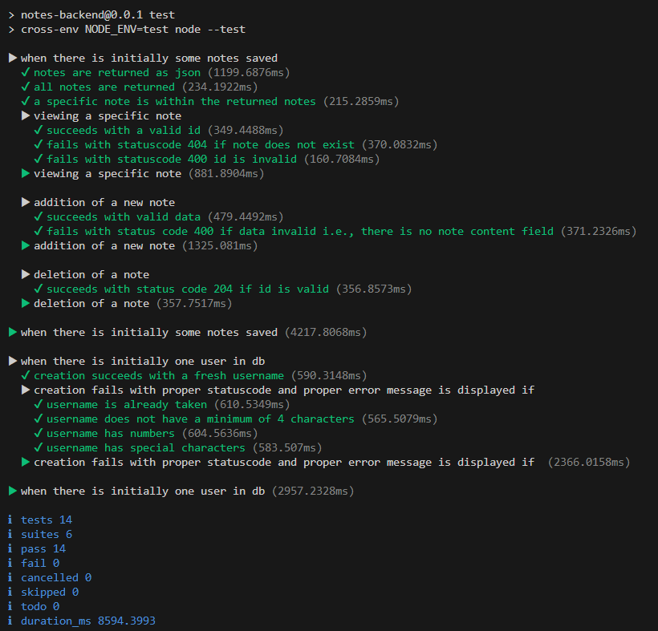

# Notes application - University of Helsinki (Deep Dive Into Modern Web Development, Part 5: Testing React Apps)

Environment Variables:
- `MONGODB_URI`
- `PORT=3001`
- `TEST_MONGODB_URI`
- `SECRET=secretforlogin`

Install dependencies from the root of the project/application

```bash
npm i
```

To run the application, in the terminal run the below command

- For practice purposes

```bash
node mongo.js yourPassword
```

or

```bash
node mongo.js
```

- Actual notes application

```bash
npm start
```

- To run the application with nodemon

```bash
npm run dev
```

To run tests (make sure to run the backend with `npm run dev` before running tests)

- To run the backend in test mode

```bash
npm run start:test
```

- To run all tests


```bash
npm test
```

or

```bash
npm run test
```

- To run tests with `only` method

```bash
npm test -- --test-only
```

- To run an individual test file

```bash
npm test -- tests/note_api.test.js
```

- To run ONE test with a specific name (can be a test name or the describe block)

```bash
npm test -- --test-name-pattern="the first note is about HTTP methods"
```

- To run tests that contains the word 'notes' in their name

```bash
npm run test -- --test-name-pattern="notes"
```

Linting (Updated with ESLint Stylistic Plugin)

- To run lint on the whole project

```bash
npm run lint
```

- Inspecting and validating a single file

```bash
npx eslint index.js
```

NOTE: When code gets refactored, there is always the risk of regression, meaning that existing functionality may break.

---

On the browser, visit for get requests:

- http://localhost:3001/ (for frontend)
- http://localhost:3001/api/notes
- http://localhost:3001/api/notes/1
- http://localhost:3001/api/users

You can also perform these operations on Postman or VS Code REST client.

NOTE: To get the `dist` directory, run the command `npm run build` from the `bloglist-frontend-vite` application and then copy the `dist` folder from the frontend folder to the backend folder. Open the application on `http://localhost:3003/` to view the frontend. The server and the application can be seen running together here.

---

REST HTTP Methods for the notes application:

| URL              | verb   | functionality                                                 |
| ---------------- | ------ | ------------------------------------------------------------- |
| NOTES Collection |
| api/notes        | GET    | fetches all resources in the collection                       |
| api/notes/1      | GET    | fetches a single resource                                     |
| api/notes        | POST   | creates a new resource based on the request data              |
| api/notes/1      | PUT    | replaces the entire identified resource with the request data |
| /api/notes/1     | DELETE | removes the identified resource                               |
| USERS Collection |
| /api/users       | GET    | fetches all resources in the collection                       |
| api/users        | POST   | creates a new resource based on the request data              |
| LOGIN            |
| api/login        | POST   | sends user credentials to get token                           |

---

## Part 5 - (a) Login in frontend

Practice - Note application: backend express server app (contd. from Part 4d)

## Part 5 - (b) props.children and proptypes

Practice - Note application: backend express server app (contd. from Part 5a)

## Part 5 - (c) Testing React apps

Practice - Note application: backend express server app (contd. from Part 5a)

## Part 5 - (d) End to end testing: Playwright

Practice - Note application: backend express server app (contd. from Part 5a)

---

### Requirements for the application:

1. Express - Express.js, or simply Express, is a back end web application framework for building RESTful APIs with Node.js

```bash
npm install express
```

2. Nodemon - reload, automatically

```bash
npm install nodemon --save-dev
```

3. REST Client Plugin (by Huachao Mao) in VSCode to run the request from the `.rest` files or use Postman

4. CORS middleware (Cross-Origin Resource Sharing)

```bash
npm install cors
```

5. Deployed on [render](https://render.com/) - Cloud Application Hosting for Developers

https://notes-app-3bjn.onrender.com

When the app is deployed in Render, make sure that the env variables from this project is saved in the Render web service --> Environment

6. MongoDB Atlas - A MongoDB provider. Create an account (here)[https://www.mongodb.com/atlas/database] and choose the free option. (MongoDB is a document-oriented NoSQL database)

7. Mongoose - Object Document Mapper library for MongoDB

```bash
npm install mongoose
```

8. dotenv - used for environment variables in a `.env` file

```bash
npm install dotenv
```

NOTE: Store the `MONGODB_URI` and `PORT` env variables in the `.env` file. Get them from the render hosted app.

NOTE: Add the database name in the URI, for example, `noteApp` in the URI `....mongodb.net/noteApp?retryWrites...`.

9. ESLint - tool for static analysis (aka "linting") that detects and flags errors in programming languages, including stylistic errors

```bash
npm install eslint --save-dev
```

To initialize a default ESlint configuration:

```bash
npx eslint --init
```

or

```bash
npm init @eslint/config
```

10. ESLint Stylistic - a plugin that defines a set of code style-related rules; stylistic Formatting for ESLint (formatting and Linting in one go, with fully customizable rules)

```bash
npm install @stylistic/eslint-plugin-js --save-dev
```

11. ESLint plugin extension (by Microsoft) integrates ESLint JavaScript into VS Code

12. node:test - Node's in-built test library

Test result:



13. cross-env (Runs scripts that set and use environment variables across platforms - achieves cross-platform compatibility) - Install cross-env as a production dependency

```bash
npm install cross-env
```

14. supertest - write tests for testing the API

```bash
npm install supertest --save-dev
```

15. express-async-errors (A dead simple ES6 async/await support hack for ExpressJS) - The 'magic' of the library allows us to eliminate the try-catch blocks completely. See `controllers/notes.js`

```bash
npm install express-async-errors
```

16. bcrypt - generates password hashes

```bash
npm install bcrypt
```

NOTE: Some Windows users have had problems with <i>bcrypt</i>. If you run into problems, remove the library with the command

```bash
npm uninstall bcrypt
```

and install <i>bcryptjs</i> instead.

17. mongoose-unique-validator (for checking the uniqueness of a field)

```bash
npm install mongoose-unique-validator
```

18. jsonwebtoken - generates JSON web tokens

```bash
npm install jsonwebtoken
```

NOTE: create an environment variable called `SECRET` and give it any value; this is used in the `controllers/login.js` file.
